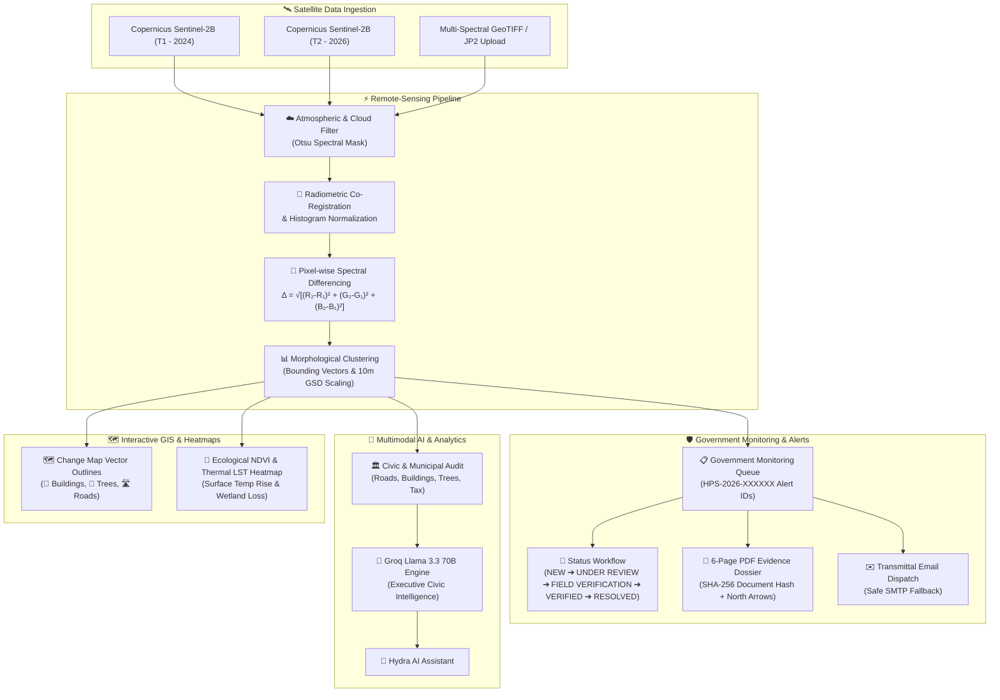

# ⬡ HYDRA POSITIONING SYSTEM

> **Government Earth Observation & AI-Powered Geospatial Intelligence Platform**
> *SIH Problem Statement SIH260009 — Automated change detection due to human activities using multi-temporal Earth Observation satellite imagery.*

[](https://fastapi.tiangolo.com)
[](https://react.dev)
[](https://www.typescriptlang.org)
[](https://postgis.net)
[](https://opencv.org)
[](https://groq.com)

---

## 📌 Overview

**HYDRA POSITIONING SYSTEM** is an end-to-end government geospatial intelligence and multi-temporal remote-sensing change detection platform. It autonomously monitors, classifies, and documents human-driven physical landscape shifts between temporal satellite passes (e.g. **Copernicus Sentinel-2B Level-1C / Level-2A MSI**).

The system equips municipal planning authorities, forest departments, and transportation ministries with **automated field verification alerts**, **evidence dossier generators (6-page PDF reports with SHA-256 integrity hashes)**, and **transmittal email workflows**.

---

## 🏛️ System Architecture



---

## ✨ Key Capabilities

### 1. 🛡️ Government Monitoring & Field Alerts
- Standardized Alert ID format: **`HPS-YYYY-XXXXXX`** (e.g. `HPS-2026-000101`).
- Compliance categories:
  - Potential Unauthorized Construction
  - Potential Road Encroachment & Expansion
  - Vegetation Clearing & Deforestation
  - Potential Land / Water Body Encroachment
  - Major Land-Use Change
- **Legal Compliance Standard**: Never claims "illegal activity confirmed" based solely on imagery; provides evidence for field review with status: `NEW`, `UNDER REVIEW`, `FIELD VERIFICATION REQUIRED`, `VERIFIED`, `DISMISSED`, `RESOLVED`.

### 2. 📄 Multi-Page PDF Evidence Dossier (`GENERATE GOVERNMENT REPORT`)
- **Page 1 (Cover)**: Official Hydra Positioning System emblem, Report ID, status badge, acquisition dates, Copernicus attribution, and **SHA-256 Document Hash**.
- **Page 2 (Executive Summary)**: What was detected, physical parameters, and impact classification.
- **Page 3 (Satellite Evidence)**: 2024 vs 2026 optical granules with **North Arrow (`▲ N`)**, scale bar, and coordinates.
- **Page 4 (Change Detection Map)**: Spectral mask and vector boundaries.
- **Page 5 (Evidence Analysis)**: Before condition, after condition, and observed physical shift.
- **Page 6 (Recommended Action)**: 5-step government field inspection protocol and **Mandatory Statutory Disclaimer**.

### 3. ✉️ Email Dispatch & Shareable Link
- Pre-populated transmittal letter attached with `Hydra_Positioning_System_Alert_HPS-2026-XXXXXX.pdf`.
- Safe server check with 1-click fallback download if SMTP is unconfigured.
- 1-click clipboard copy for secure internal sharing.

### 4. 🛰️ Multi-Temporal Remote Sensing & Ecological Heatmaps
- **Cloud-Filtered Differencing**: Eliminates false positives from atmospheric reflections.
- **Ecological NDVI & LST Heatmap**: Visualizes canopy chlorophyll loss and urban microclimate heating ($+2.8^\circ\text{C}$ rise).
- **Dedicated Vector Change Map**: Blueprint polygons with discrete emoji pins (**`🏢`**, **`🌳`**, **`🛣️`**).

---

## 🛠️ Quick Start

```bash
# 1. Clone
git clone https://github.com/24ug1byai106-png/Geowatch.git
cd Geowatch

# 2. Frontend
cd frontend
npm install
npm run dev

# 3. Backend
cd ../changedetec
uvicorn app.main:app --reload --port 8000
```

---

## 📜 Statutory Disclaimer

> *Hydra Positioning System provides satellite-based geospatial observations and AI-assisted change analysis. Satellite imagery alone cannot establish legal ownership, authorization, or illegality. This report is intended to support government review and field verification. Final determination should be made using applicable official records, regulations, and on-ground verification.*

---

## 📄 Copernicus Attribution

*Contains modified Copernicus Sentinel data [2024–2026] processed via Hydra Positioning System.*
