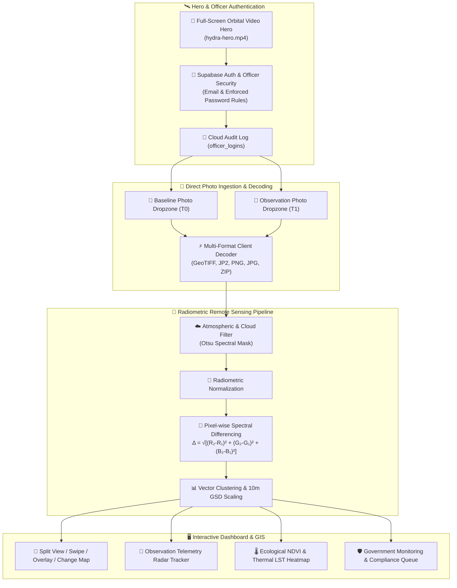

# ⬡ HYDRA POSITIONING SYSTEM

> **Government Earth Observation & AI-Powered Geospatial Intelligence Platform**  
> *SIH Problem Statement SIH260009 — Automated change detection due to human activities using multi-temporal Earth Observation satellite imagery.*

[](https://fastapi.tiangolo.com)
[](https://react.dev)
[](https://www.typescriptlang.org)
[](https://supabase.com)
[](https://opencv.org)
[](https://groq.com)

---

## 📌 Overview

**HYDRA POSITIONING SYSTEM (HPS)** is a mission-grade government geospatial intelligence and multi-temporal remote-sensing change detection platform. It autonomously ingests, processes, classifies, and audits physical landscape transformations between temporal satellite passes (e.g. **Copernicus Sentinel-2B Level-1C / Level-2A MSI**).

The system equips municipal development authorities, forest preservation departments, and national transportation ministries with **dedicated in-canvas satellite photo dropzones**, **on-demand pixel differencing**, **ecological NDVI / LST thermal heatmaps**, **radar telemetry**, and **automated field verification alerts** with **6-page evidence dossier generators**.

---

## 🏛️ System Architecture



---

## ✨ Core Modules & Key Capabilities

### 1. 🌌 Full-Screen Satellite Video Hero & Secure Officer Portal
- **Orbital Background**: Seamless auto-playing, looping, and muted satellite Earth observation video background.
- **Glassmorphic Authentication**: Frosted glass login modal (`backdrop-filter: blur(16px)`).
- **Supabase Cloud Sync**: Real-time authentication via Supabase Auth (`supabase.auth.signInWithPassword` & `supabase.auth.signUp`) with activity logging to the `officer_logins` table.
- **Password Security Enforcement**: Dynamic client-side checks requiring 8+ characters, uppercase, numbers, and special symbols.

### 2. 📁 Dedicated Satellite Photo Ingestion (Before & After)
- **Zero Preloaded Clutter**: The dashboard workspace opens with **two clean, interactive Drag & Drop upload dropzones**:
  - `[ 📁 BEFORE SATELLITE PHOTO (T0) ]` — Baseline acquisition.
  - `[ 📁 AFTER SATELLITE PHOTO (T1) ]` — Observation pass.
- **Multi-Format Support**: Direct in-browser parsing for **GeoTIFF (`.tif`, `.tiff`)**, **JPEG2000 (`.jp2`)**, **PNG**, **JPG**, and **ZIP** archives.
- **On-Demand Differencing**: Pixel differencing triggers only when the officer clicks `[ ⚡ ANALYZE PHOTOS ]`.

### 3. 🗺️ Multi-Mode Temporal Visualizer
- **Split View**: Side-by-side synchronized comparison.
- **Swipe Slider**: Interactive divider slider revealing temporal transformations in real-time.
- **Alpha Overlay**: Continuous opacity blending between baseline and observation passes.
- **Change Map**: Detected change vector boundaries classified into:
  - 🟧 **Potential Structural Shifts** (Urban buildings & infrastructure)
  - 🟩 **Potential Vegetation Shifts** (Canopy loss & tree clearing)
  - 🟥 **High-Intensity Surface Shifts** (Excavation & ground clearing)

### 4. 📡 Observation Telemetry & Ecological Thermal Heatmap
- **Radar Active Tracker**: Live sweep radar tracking satellite orbital coordinates, carrier downlink status (`1.18 Gbps`), and spectral resolution ($10.0\text{m/px}$).
- **Ecological NDVI & LST Heatmap**: Multi-spectral GIS map toggles displaying:
  - **`[ 🌿 NDVI Vegetation ]`**: Mean Canopy Chlorophyll Loss.
  - **`[ 🌡️ Thermal LST ]`**: Surface Temperature & Urban Microclimate Heat Rise ($+2.8^\circ\text{C}$).
  - **`[ 💧 Water NDWI ]`**: Surface Moisture & Wetland Shifts.

### 5. 🛡️ Government Monitoring & Statutory Compliance Dossiers
- Standardized Alert ID format: **`HPS-YYYY-XXXXXX`** (e.g. `HPS-2026-000101`).
- Compliance Status Lifecycle: `NEW` ➔ `UNDER REVIEW` ➔ `FIELD VERIFICATION REQUIRED` ➔ `VERIFIED` ➔ `RESOLVED`.
- **6-Page Evidence PDF Dossier**:
  - Official Hydra Positioning System emblem, Report ID, and **SHA-256 Document Integrity Hash**.
  - Dual satellite optical granules with **North Arrow (`▲ N`)**, scale bar, and coordinates.
  - Recommended 5-step statutory field inspection protocol.

---

## 🛠️ Tech Stack

| Domain | Technology |
| :--- | :--- |
| **Frontend UI** | React 19, TypeScript, Vite, Vanilla CSS Design System, Lucide Icons |
| **Mapping & GIS** | Leaflet, React-Leaflet, Canvas-based Otsu differencing |
| **Imagery Decoders** | `geotiff.js`, `utif.js`, `jszip` |
| **Backend API** | Python FastAPI, Uvicorn, Pydantic |
| **Computer Vision** | OpenCV, NumPy, SciPy, Pillow |
| **Database & Auth** | Supabase Auth, PostgreSQL, PostGIS, Table Audit Logs |
| **AI Intelligence** | Groq Llama 3.3 70B Versatile LLM |

---

## 🚀 Quick Start Guide

### 1. Clone Repository
```bash
git clone https://github.com/24ug1byai106-png/Geowatch.git
cd Geowatch
```

### 2. Frontend Setup
```bash
cd frontend
npm install
npm run dev
```
*Frontend runs locally on `http://localhost:5173`.*

### 3. Backend Setup
```bash
cd ../changedetec
pip install -r requirements.txt
uvicorn app.main:app --reload --port 8000
```
*FastAPI documentation available at `http://localhost:8000/docs`.*

---

## 📜 Statutory Disclaimer

> *Hydra Positioning System provides satellite-based geospatial observations and AI-assisted change analysis. Satellite imagery alone cannot establish legal ownership, authorization, or illegality. This platform is intended to support government review and field verification. Final determination should be made using applicable official records, municipal zoning regulations, and on-ground inspection.*

---

## 📄 Copernicus Attribution

*Contains modified Copernicus Sentinel data [2024–2026] processed via Hydra Positioning System.*
